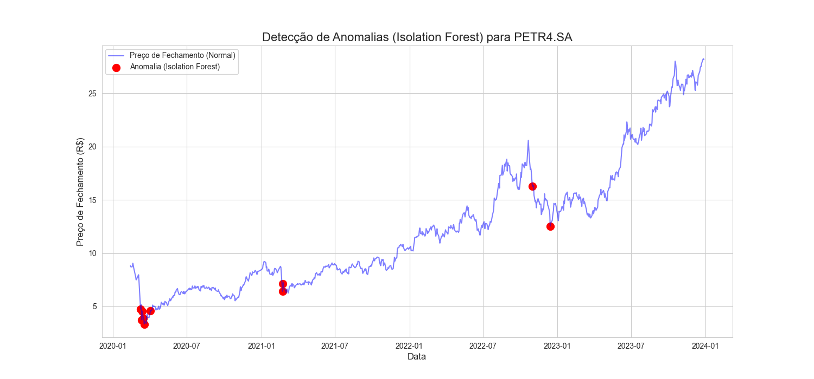
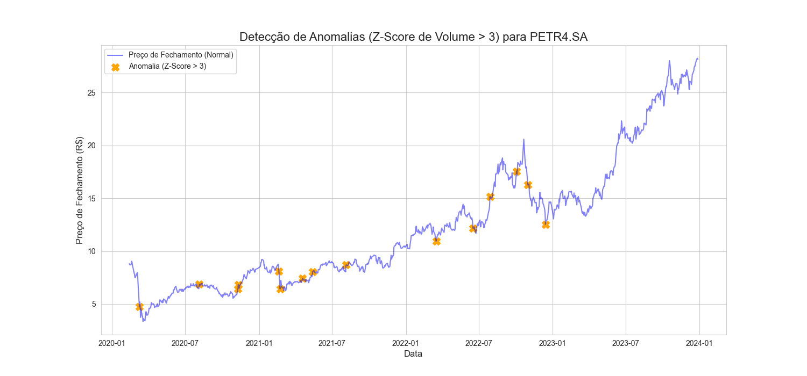

# Projeto 1: Detecção de Anomalias em Negociações de Mercado (PETR4.SA)

Este projeto simula uma atividade central da área de Supervisão de Mercados: a **detecção de padrões atípicos** em negociações. O objetivo é identificar dias com comportamentos de volume e preço que fogem do padrão, podendo indicar a necessidade de uma investigação mais profunda (ex: suspeita de *insider trading* ou manipulação de mercado).

Este projeto demonstra competências em **Python**, **Pandas**, **Estatística** e **Machine Learning** (não supervisionado) aplicadas ao contexto do mercado financeiro.

---

## 🛠️ Tecnologias Utilizadas

* **Python 3.x**
* **yfinance:** Para download dos dados históricos da B3.
* **Pandas & NumPy:** Para manipulação e engenharia de features.
* **Scikit-learn:** Para o modelo de detecção de anomalias (Isolation Forest).
* **Matplotlib & Seaborn:** Para visualização dos resultados.

---

## 🚀 Como Executar

1.  **Ambiente Virtual (Recomendado):**
    ```bash
    # Criar o ambiente
    python -m venv venv
    # Ativar (Windows)
    .\venv\Scripts\Activate
    ```

2.  **Instalar Dependências:**
    ```bash
    pip install pandas yfinance scikit-learn matplotlib seaborn
    ```

3.  **Executar o Script:**
    ```bash
    python projeto_anomalias.py
    ```

O script irá baixar os dados, processar as análises, salvar os gráficos (`anomalias_ml.png` e `anomalias_stats.png`) na pasta e imprimir os insights no console.

---

##  Metodologia e Análise

Foram utilizadas duas abordagens complementares para "flaggar" dias atípicos:

### 1. Abordagem Estatística (Z-Score)

Uma regra estatística simples foi aplicada: um dia é considerado atípico se o seu volume de negociação for **maior que 3 desvios padrão** acima da média móvel de 30 dias (Z-Score > 3).

* **Pró:** Rápido, simples de explicar e eficaz para identificar picos extremos de volume.
* **Contra:** Foca em apenas uma variável (volume) e ignora a relação com o preço.

### 2. Abordagem de Machine Learning (Isolation Forest)

Foi usado um modelo de *Isolation Forest* (Floresta de Isolamento), um algoritmo não supervisionado ideal para detecção de anomalias.

* **Pró:** É uma abordagem multivariada. O modelo foi treinado considerando **duas features simultaneamente:** o `Log do Volume` e a `Variação Diária do Preço` (`Daily_Return`). Isso permite que ele encontre anomalias que a abordagem estatística não veria (ex: um dia de volume *médio* mas com variação de preço *extrema*, ou vice-versa).
* **Contra:** Requer mais processamento e é um modelo "caixa-preta" (embora simples).

---

## 📈 Resultados e Insights

O script gera dois gráficos que plotam o preço de fechamento da `PETR4.SA` e destacam os dias sinalizados como anômalos por cada método.

### Gráfico 1: Anomalias por Machine Learning (Isolation Forest)

Esta visualização destaca os dias que o modelo de ML considerou atípicos com base na *combinação* de volume e variação de preço.



### Gráfico 2: Anomalias por Estatística (Z-Score de Volume)

Esta visualização destaca os dias onde o volume, por si só, foi estatisticamente extremo (mais de 3 desvios padrão acima da média).



### 💡 Insights da Análise

1.  **Contexto:** O objetivo deste projeto foi identificar dias com padrões de negociação atípicos (volume e preço) para a PETR4.SA, que poderiam justificar uma investigação mais profunda por parte da área de supervisão de mercados.
2.  **Método ML (Isolation Forest):** O modelo sinalizou dias que apresentaram uma **combinação atípica** de alto volume e grande variação de preço (para cima ou para baixo).
3.  **Método Estatístico (Z-Score):** O método, focado **apenas no volume**, sinalizou dias onde o volume foi mais de 3 desvios padrão acima da média móvel de 30 dias.
4.  **Conclusão:** Os dias sinalizados (especialmente aqueles identificados por *ambos* os métodos) seriam os primeiros a serem analisados por um analista. O próximo passo seria correlacionar essas datas com a divulgação de notícias relevantes (ex: resultados financeiros, fatos relevantes, relatórios). **A ausência de notícias públicas que justifiquem o movimento atípico é um forte indicativo de *insider trading* ou manipulação de mercado** e demandaria uma investigação formal.
